# RF-DETR-FSCD: Few-Shot Counting and Detection

## <a name="Weights"></a>权重文件 (Weights)
💡 Note: 算力限制当前提供的权重仅训练了 10 个 Epoch。随着训练轮数的增加，模型性能有望进一步提升。
通过网盘分享的文件：checkpoint0009.pth
链接: https://pan.baidu.com/s/1qjRXuc6sIl0WlkLGKzSyiA?pwd=wfei 提取码: wfei


## <a name="visual-results"></a>🖼️ 可视化展示 (Visual Results)

仅需 **1 个示例框 (Single Exemplar Box)**，模型即可在极少样本条件下完成全图计数与检测。


|  |  |  |
| :---: | :---: | :---: |
| 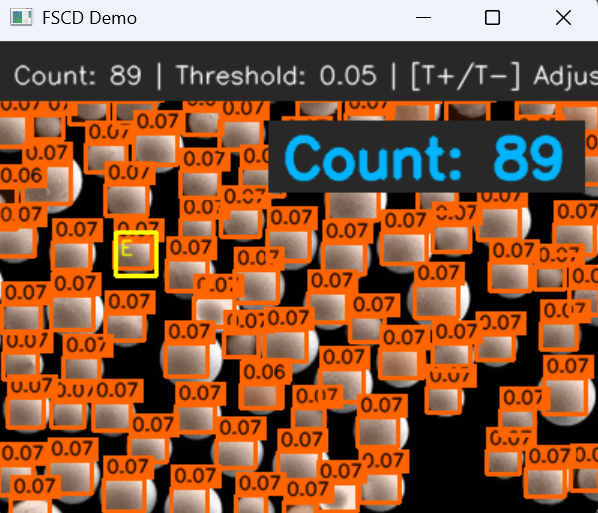 | 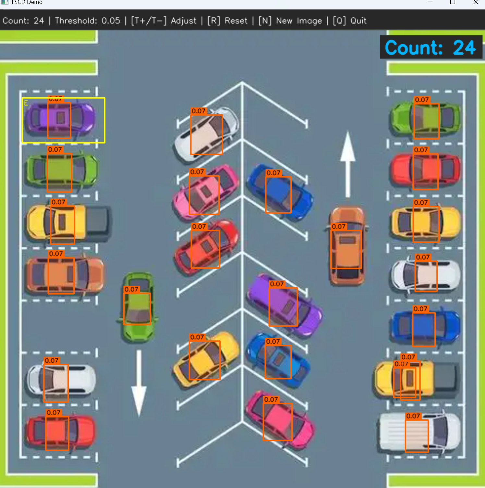 | 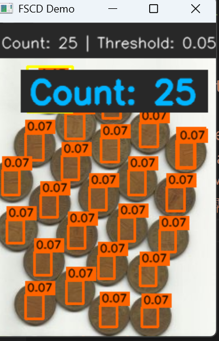 |
| 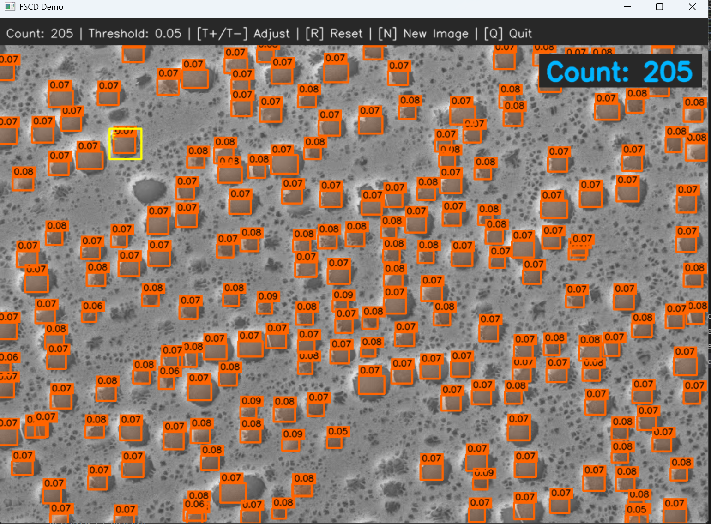 | 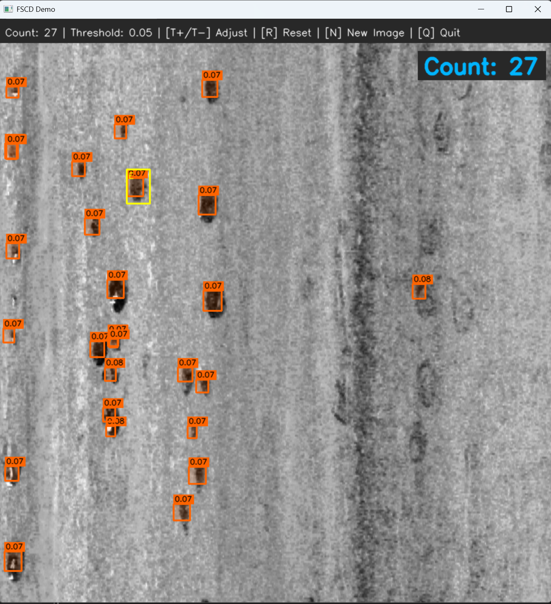 | 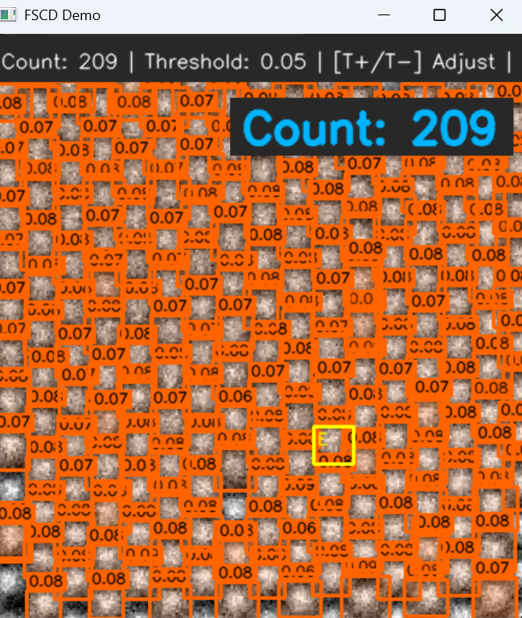 |
| 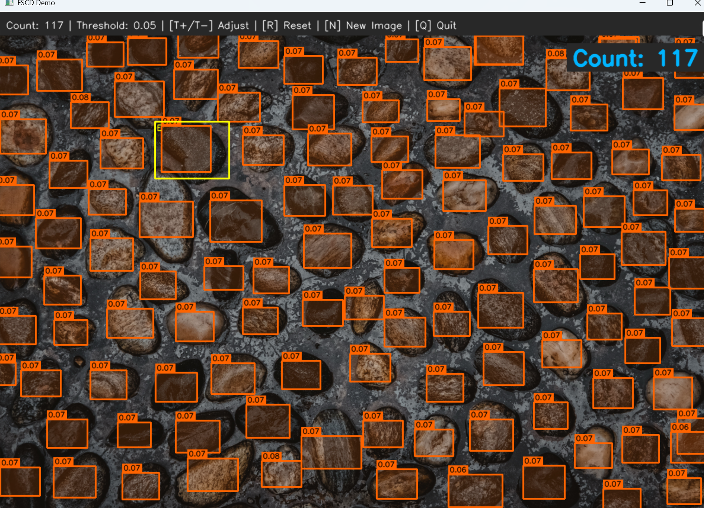 | 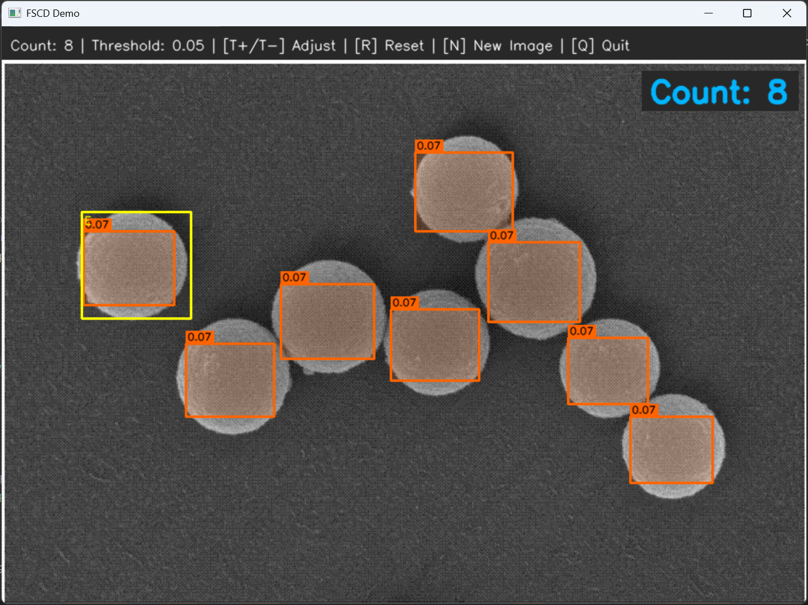 | 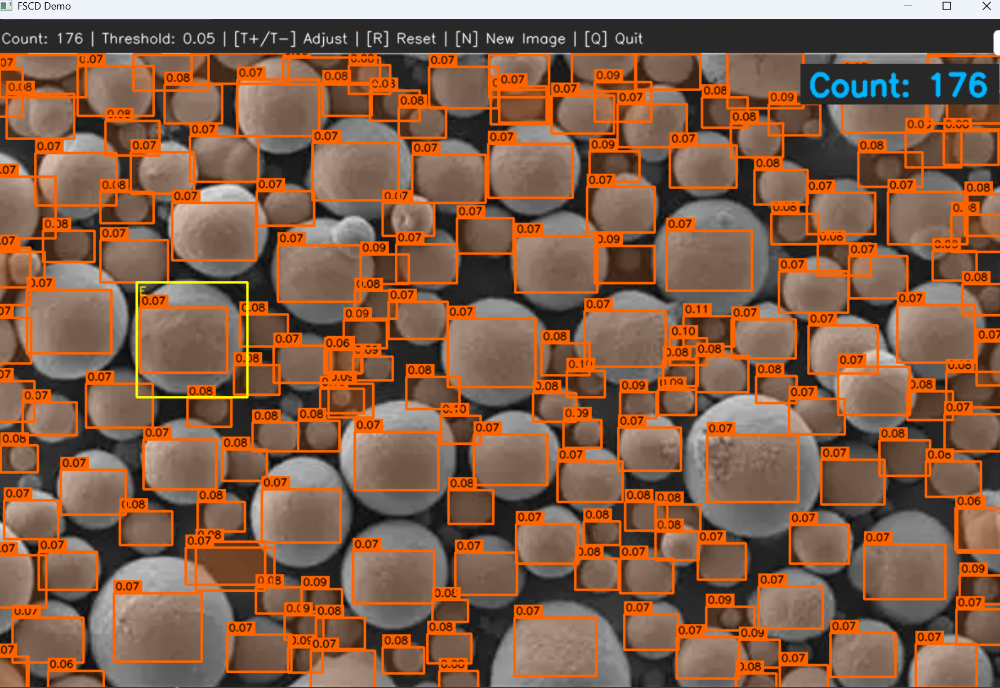 |
| 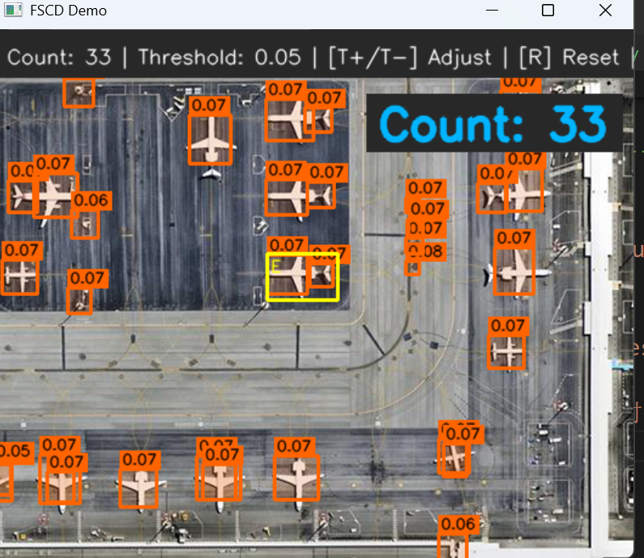 | 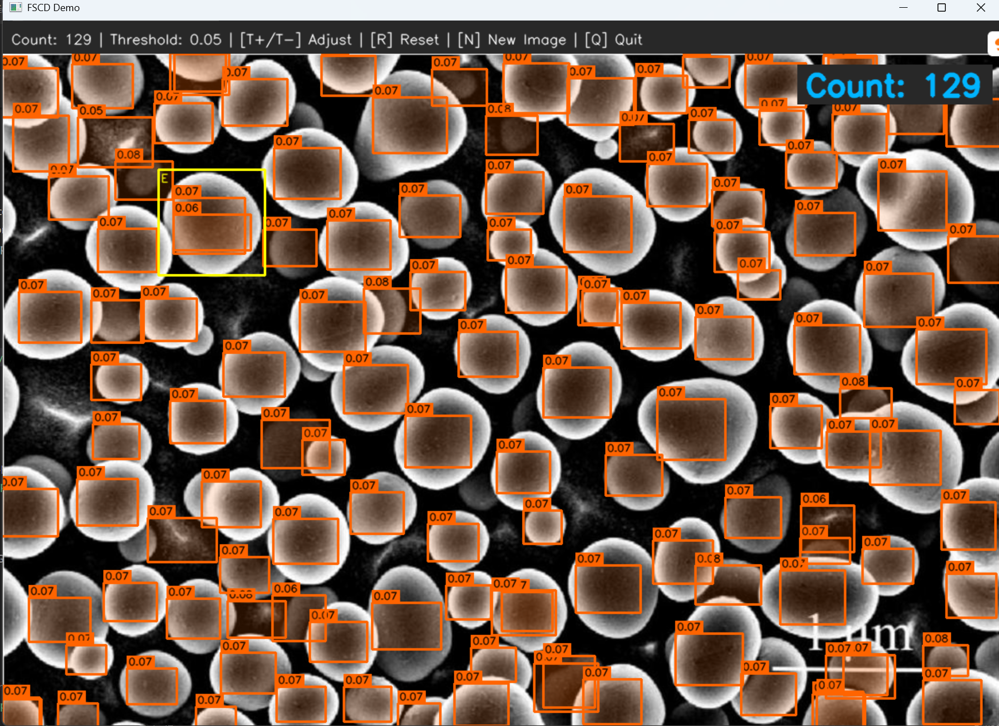 | 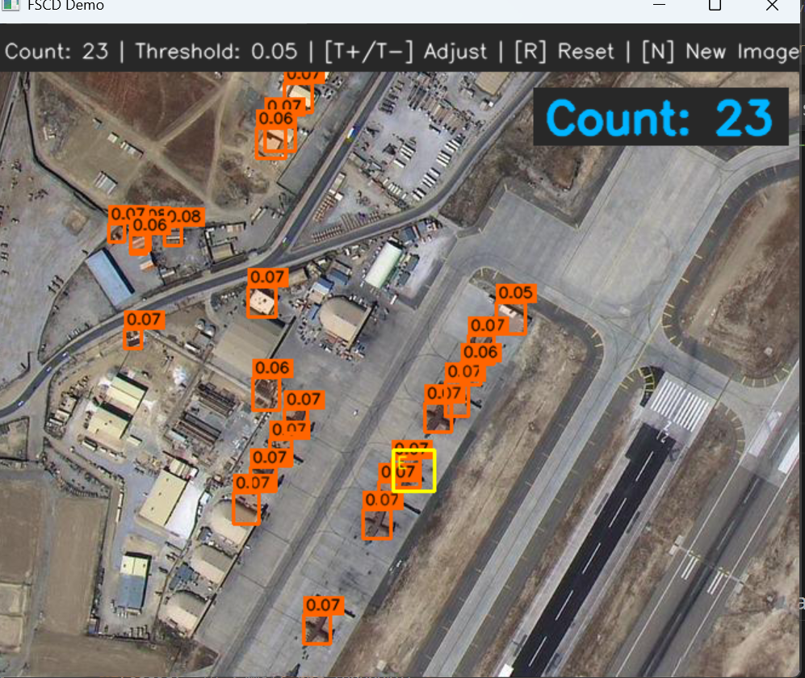 |

> *注：黄色框为用户提供的 Exemplar，橙色框为模型检测出的目标。*

---

## <a name="introduction"></a>📖 简介 (Introduction)

**RF-DETR-FSCD** 是一个 **Class-Agnostic（类别无关）** 的少样本计数检测器。它在原始 RF-DETR (ICLR 2026) 的基础上进行了深度改造，使其不再局限于 COCO 80 类，而是能够根据用户提示（Prompts）动态检测任意类别的目标。

### 核心特性

* **One-Shot Counting:** 给定一张图片和 **1 个示例框**，自动计数同类物体。
* **Soft Count Optimization:** 引入基于 Sigmoid 响应和的计数损失，大幅提升密集场景下的计数精度。
* **Real-time Performance:** 继承 RF-DETR 的高效架构，支持实时推理。

---

## <a name="model-architecture"></a>🏗️ 核心架构 (Model Architecture)

模型从 `LWDETR` 演进为 `FscdLWDETR`，主要包含以下改造：

### 1. Exemplar Prototype Extractor

从用户提供的 **单 Exemplar Box** 中提取特征：

* **RoI Align:** 在最高分辨率特征图上截取 7x7 特征。
* **Projection:** 经 `Linear` + `LayerNorm` 投影，生成代表该类别的 **Prototype** 向量。

### 2. Exemplar Conditioning Module (FiLM)

将 Prototype 注入 Transformer Decoder：

* 生成缩放因子 () 和偏移量 ()。
* 对多尺度特征图执行 **FiLM (Feature-wise Linear Modulation)** 操作：。
* 使 Decoder 在"知道要找什么"的条件下工作。

### 3. Prototype-enhanced Objectness

改造分类头以适应 Class-Agnostic 任务：

* **Query 增强:** 计算 Transformer Query 与 Prototype 的 **余弦相似度 (Cosine Similarity)**。
* **最终得分:** 。
* **分类头变更:** 输出维度从 80 (COCO) 变为 1 (Binary Objectness)。

---

## <a name="loss-functions"></a>📉 损失函数 (Loss Functions)

| 损失项 | 原始 RF-DETR | **RF-DETR-FSCD** | 说明 |
| --- | --- | --- | --- |
| **Classification** | Multi-class Focal | **Binary Focal Loss** | , 仅区分前景/背景。 |
| **Counting** | N/A | **L1 Soft Count** | 。 |
| **Regression** | L1 + GIoU | L1 + GIoU | 保持不变。 |

---

## <a name="installation"></a>⚙️ 安装与准备 (Installation)

```bash
# 1. 克隆代码
git clone https://github.com/yourusername/rf-detr-fscd.git
cd rf-detr-fscd

# 2. 安装环境
pip install -r requirements.txt
# 编译 CUDA 算子 (如果需要)
pip install -e .

```

### 数据集准备 (FSCD-147)

请确保数据集目录结构如下，并更新 `config.py` 中的路径：

```text
data/
  FSCD147/
    images_560x560/  # 统一 Resize 到 560x560
    annotation/
      instances_val.json
      instances_test.json

```

---

## <a name="training"></a>🚀 训练 (Training)

使用 `TrainFscd.py` 启动训练。模型会自动加载 `rf-detr-base.pth` 预训练权重（跳过不匹配的分类头和新增模块）。

### 关键配置

* **学习率策略:**
* Backbone (DINOv2): `1e-5`
* Decoder / Heads: `5e-5`
* **Schedule:** 3 Epoch Warmup + Cosine Decay。


* **Group DETR:** 训练时使用 13 组 Queries (3900个) 加速收敛，推理时仅用 300 个。

```bash
python TrainFscd.py \
  --config-file config/rf_detr_fscd_config.py \
  --coco_path /path/to/fscd147 \
  --output_dir output/fscd_v1 \
  --batch_size 4

```

---

## <a name="inference"></a>📊 推理与评估 (Inference)

### 1. 交互式 Demo

启动 GUI 界面，通过鼠标画 **1个框** 进行实时计数：

```bash
python DemoFscd.py \
  --resume output/fscd_v1/checkpoint.pth \
  --image_path assets/test_image.jpg

```

### 2. 精度评估

计算 MAE (Mean Absolute Error) 和 RMSE。评估时采用 **Soft Count** (sigmoid求和) 以获得更鲁棒的结果。

```bash
python EvalFscd.py \
  --coco_path /path/to/fscd147 \
  --resume output/fscd_v1/checkpoint.pth \
  --eval_set test

```

---

<a name="future-work"></a>📅 后续计划 (Future Work)
当前版本展示了 RF-DETR 在少样本计数任务上的潜力，但仍有优化空间。我们计划在未来版本中通过以下方式进一步提升性能：

[ ] 优化边界框损失 (Refine BBox Loss): 计划改进回归损失函数（如引入 CIoU 或 DIoU），以进一步提升检测框的定位精度 (IoU)。

[ ] 引入 NMS 后处理 (Post-processing): 探索在推理阶段加入非极大值抑制 (Non-Maximum Suppression)，以减少密集场景下的重叠预测框。

[ ] 增加训练轮次 (Longer Training): 目前提供的权重仅训练了 9 个 Epoch。我们计划进行更长时间的训练，以充分挖掘模型潜力并提升泛化能力。

## Acknowledgement

* Base model: [RF-DETR](https://www.google.com/search?q=https://github.com/roboflow/rf-detr)
* Dataset: [FSCD-147](https://www.google.com/search?q=https://github.com/VisWan/FSC-147)

# RF-DETR → FSCD 完整改造技术文档

> **项目仓库**：[Yes-buter/RF-DETR-FSCD](https://github.com/Yes-buter/RF-DETR-FSCD)  
> **基础模型**：[roboflow/rf-detr](https://github.com/roboflow/rf-detr)（RF-DETR，ICLR 2026）  
> **目标任务**：FSCD（Few-Shot Counting and Detection，少样本目标计数与检测）  
> **目标数据集**：FSCD-147、FSCD-LVIS  
> **文档日期**：2026-02-24  

---

## 目录

1. [项目概述](#1-项目概述)
2. [原始 RF-DETR 架构基础](#2-原始-rf-detr-架构基础)
3. [FSCD 任务定义](#3-fscd-任务定义)
4. [新增��修改的文件清单](#4-新增与修改的文件清单)
5. [核心模型改造：LWDETR → FscdLWDETR](#5-核心模型改造lwdetr--fscdlwdetr)
6. [损失函数改造](#6-损失函数改造)
7. [匈牙利 Matcher 改造](#7-匈牙利-matcher-改造)
8. [数据集加载器：Fscd147Dataset](#8-数据集加载器fscd147dataset)
9. [数据增强改造](#9-数据增强改造)
10. [训练流程设计](#10-训练流程设计)
11. [评估指标体系](#11-评估指标体系)
12. [配置系统改造](#12-配置系统改造)
13. [权重加载策略](#13-权重加载策略)
14. [推理与工具脚本](#14-推理与工具脚本)
15. [环境配置](#15-环境配置)
16. [优化调参历程](#16-优化调参历程)
17. [实验结果记录](#17-实验结果记录)
18. [已知问题与后续方向](#18-已知问题与后续方向)
19. [关键 Bug 记录](#19-关键-bug-记录)

---

## 1. 项���概述

### 1.1 改造动机

RF-DETR 是 Roboflow 发布的高性能实时目标检测模型（在 COCO 上 Base 版达到 53.2 AP，Large 版达到 57.4 AP）。其核心优势包括：

- **DINOv2 Backbone**：强大的自监督视觉特征，泛化能力出色
- **LW-DETR 解码器**：基于可变形注意力的轻量级 Transformer 解码器
- **Group DETR**：训练时使用多组 query 加速收敛

然而，RF-DETR 是一个**封闭集（Closed-Set）多类别检测模型**，针对固定的 80 个 COCO 类别，无法处理 FSCD 任务中"测试时类别未知"的场景。

### 1.2 改造目标

将 RF-DETR 改造为支持 FSCD 任务的模型：

| 能力 | 原始 RF-DETR | RF-DETR-FSCD |
|------|-------------|--------------|
| 分类方式 | 固定 80 类 | Class-Agnostic（类别无关）|
| 额外输入 | 无 | 1~3 个 Exemplar Bounding Box |
| 输出 | 检测框 + 类别 | 检测框 + 目标计数 |
| 训练数据集 | COCO | FSCD-147 |

### 1.3 参考模型

| 模型 | 核心思路 | 参考点 |
|------|---------|--------|
| **Counting-DETR** | 基于 DETR，使用 exemplar 特征增强 decoder query | 整体框架 |
| **DAVE** | 两阶段：先粗检测，再用 exemplar 验证 | 多阶段设计 |
| **GeCo** | SAM 生成 exemplar 原型，dense query | 原型提取方式 |

---

## 2. 原始 RF-DETR 架构基础

### 2.1 整体架构（Base 版本）

```
输入图像 [B, 3, H, W]
    │
    ▼
DINOv2 Backbone（ViT-S，Windowed Attention）
    │  多尺度特征图
    ▼
Projector（通道降维 + 多尺度对齐）
    │  [B, 256, H/8, W/8], [B, 256, H/16, W/16]...
    ▼
LW-DETR Transformer Decoder
  ├─ Two-Stage：先生成 encoder proposals（num_select=300）
  ├─ Group DETR：训练时 query × 13 = 3900 个，推理时仅用 300 个
  └─ 可变形交叉注意力（Deformable Cross-Attention）
    │
    ▼
检测头
  ├─ class_embed：Linear(256 → 80)   ← 改造为 ObjectnessEmbed: Linear(256 → 1)
  └─ bbox_embed： MLP(256 → 4)       ← 保留不变
```

### 2.2 关键超参数（Base vs Large）

| 参数 | Base | Large | 说明 |
|------|------|-------|------|
| `encoder` | `dinov2_windowed_small` | `dinov2_windowed_base` | Backbone 规格 |
| `hidden_dim` | 256 | 384 | Transformer 隐层维度 |
| `num_queries` | 300 | 300 | 推理时的 query 数 |
| `num_select` | 300 | 300 | Two-stage 第一阶段候选数 |
| `dec_layers` | 6 | 6 | Decoder 层数 |
| `sa_nheads` | 8 | 12 | Self-attention 头数 |
| `ca_nheads` | 16 | 24 | Cross-attention 头数 |
| `dec_n_points` | 2 | 4 | 可变形注意力采样点数 |
| `group_detr` | 13 | 13 | 训练 query 分组数 |
| `projector_scale` | `["P4"]` | `["P3","P5"]` | 多尺度投影层 |
| `pretrain_weights` | `rf-detr-base.pth` | `rf-detr-large.pth` | 预训练权重 |

---

## 3. FSCD 任务定义

### 3.1 任务描述

**Few-Shot Counting and Detection（FSCD）**：给定一张图像和 1~3 个 exemplar bounding box（框出"要数什么"），模型需要：

1. 检测出图中所有同类目标的边界框
2. 输出目标总数（计数）
3. 类别是 class-agnostic（不依赖预定义类别标签）

### 3.2 FSCD-147 数据集

```
FSCD147/
├── images_384_VarV2/                               # 图像（384 分辨率，可变）
├── gt_density_map_adaptive_512_512_object_VarV2/   # 密度图（未直接使用）
├── annotation_FSC147_384.json                      # 主标注文件
├── Train_Test_Val_FSC_147.json                     # 数据集划分
├─�� instances_val.json                              # COCO 格式验证集标注
└── instances_test.json                             # COCO 格式测试集标注
```

**数据集规模**：
- Train：3659 张
- Val：1286 张
- Test：1190 张

**`annotation_FSC147_384.json` 格式**：

```json
{
  "image_filename.jpg": {
    "H": 384,
    "W": 512,
    "box_examples_coordinates": [
      [[y1,x1], [y2,x2], [y3,x3], [y4,x4]],
      [[y1,x1], [y2,x2], [y3,x3], [y4,x4]],
      [[y1,x1], [y2,x2], [y3,x3], [y4,x4]]
    ],
    "points": [[x,y], [x,y], ...],
    "density_path": "...",
    "ratio_h": 1.0,
    "ratio_w": 1.0
  }
}
```

> ⚠️ **重要**：`box_examples_coordinates` 使用 4 个角点表示，坐标顺序为 `[y, x]`（与常见 `[x, y]` 相反），解析时需交换坐标轴。

---

## 4. 新增与修改的文件清单

### 4.1 新建文件

| 文件路径 | 说明 |
|---------|------|
| `rf-detr/rfdetr/models/FscdDetr.py` | FSCD 核心模型（`FscdLWDETR`、`FscdSetCriterion`、`FscdPostProcess`、`BuildFscdCriterionAndPostprocessors`） |
| `rf-detr/rfdetr/models/Exemplar.py` | Exemplar 特征提取与 FiLM 条件化模块（`ExemplarPrototypeExtractor`、`ExemplarConditioningModule`） |
| `rf-detr/rfdetr/FscdMain.py` | 模型管理类（`FscdModel`），负责模型构建与预训练权重加载 |
| `rf-detr/rfdetr/FscdEngine.py` | 训练/评估引擎（`FscdTrainOneEpoch`、`FscdEvaluate`、`ScanThreshold`） |
| `rf-detr/rfdetr/datasets/Fscd147.py` | FSCD-147 数据集加载器（`Fscd147Dataset`、`BuildFscd147`） |
| `rf-detr/TrainFscd.py` | 完整训练启动脚本（CLI + 训练循环 + 评估 + 断点续训） |
| `rf-detr/DemoFscd.py` | 交互式推理演示（OpenCV 鼠标画框 → 推理 → 可视化） |
| `rf-detr/EvalFscd.py` | 标准 Benchmark 评估脚本（FSCD-147 / FSCD-LVIS，全套指标） |

### 4.2 修改的原有文件

| 文件路径 | 修改内容 |
|---------|---------|
| `rf-detr/rfdetr/config.py` | 新增 `RFDETRFSCDConfig`、`RFDETRFSCDLargeConfig`、`FSCDTrainConfig` |
| `rf-detr/rfdetr/detr.py` | 新增 `RFDETRFSCD` 类（对外 API） |
| `rf-detr/rfdetr/__init__.py` | 导出 `RFDETRFSCD` |
| `rf-detr/rfdetr/datasets/__init__.py` | 注册 `"fscd147"` 数据集路由 |
| `rf-detr/rfdetr/datasets/transforms.py` | 修复 `crop`/`hflip`/`SquareResize` 对 `exemplar_boxes` 和 `points` 的支持；新增 `PhotometricDistort` |
| `rf-detr/rfdetr/models/matcher.py` | `focal_alpha`/`focal_gamma` 改为可配置参数 |
| `rf-detr/pyproject.toml` | 配置 PyTorch CUDA 索引源，升级 `transformers >= 4.44` |

---

## 5. 核心模型改造：LWDETR → FscdLWDETR

### 5.1 改造总览

```
原始 LWDETR：
  图像 → Backbone → Projector → Transformer → class_embed(80) + bbox_embed

FscdLWDETR：
  图像 + ExemplarBoxes
    │           │
    ▼           ▼
  Backbone   ExemplarPrototypeExtractor（新增）
    │               │ Prototype [B, HiddenDim]
    ▼               ▼
  Projector → ExemplarConditioningModule（新增，FiLM）
    │  条件化后的多尺度特征图
    ▼
  Transformer Decoder
    │  Query 特征 [B, NQ, HiddenDim]
    ▼
  ProtoProjection（新增）→ Cosine Similarity
    │
    ▼
  ObjectnessEmbed(1) + CosineSim + bbox_embed(4)
```

### 5.2 新增模块一：ExemplarPrototypeExtractor

**文件**：`rfdetr/models/Exemplar.py`

**功能**：从 exemplar bounding box 中提取代表"要找什么"的原型向量。

**结构**：

```python
class ExemplarPrototypeExtractor(nn.Module):
    def __init__(self, HiddenDim, PoolSize=7, PrototypeDim=256):
        self.RoiAlign = torchvision.ops.roi_align
        self.Proj     = nn.Linear(HiddenDim * PoolSize * PoolSize, PrototypeDim)
        self.Norm     = nn.LayerNorm(PrototypeDim)

    def forward(self, MultiScaleFeats, ExemplarBoxes):
        # ExemplarBoxes: [B, K, 4]（xyxy 绝对坐标）
        # 选取最高分辨率（stride 最小）的特征图
        Feat = MultiScaleFeats[0]           # [B, C, H, W]

        # 构建 RoI Align 所需格式
        Rois = build_rois(ExemplarBoxes)    # [(batch_idx, x1, y1, x2, y2), ...]

        # RoI Align：每个 exemplar 提取 PoolSize×PoolSize 特征
        Pooled = self.RoiAlign(Feat, Rois,
                               output_size=(self.PoolSize, self.PoolSize),
                               spatial_scale=1.0 / Stride)
        # Pooled: [B*K, C, PoolSize, PoolSize]

        # Flatten + 投影
        Pooled = Pooled.flatten(1)                  # [B*K, C*P*P]
        Proto  = self.Norm(self.Proj(Pooled))        # [B*K, PrototypeDim]

        # Reshape 并对 K 个 exemplar 求平均
        Proto  = Proto.view(B, K, -1).mean(dim=1)   # [B, PrototypeDim]
        return Proto
```

**设计要点**：
- 在**最高分辨率**特征图上做 RoI Align，保留最细粒度的局部纹理信息
- 多个 exemplar 特征**平均**得到最终原型，保持对 exemplar 数量（1~3 个）的灵活性
- `LayerNorm` 稳定训练初期的特征幅度

### 5.3 新增模块二：ExemplarConditioningModule

**文件**：`rfdetr/models/Exemplar.py`

**功能**：将 Prototype 向量注入多尺度特征图，使 Transformer Decoder 在"知道要找什么"的条件下处理图像特征。

**方法**：FiLM（Feature-wise Linear Modulation）

```python
class ExemplarConditioningModule(nn.Module):
    def __init__(self, HiddenDim, NumHeads=8, NumScales=3):
        self.ScaleProj = nn.Linear(HiddenDim, HiddenDim)
        self.ShiftProj = nn.Linear(HiddenDim, HiddenDim)

    def forward(self, MultiScaleFeats, Prototype):
        # Prototype: [B, HiddenDim]
        Scale = self.ScaleProj(Prototype)               # [B, HiddenDim]
        Shift = self.ShiftProj(Prototype)               # [B, HiddenDim]

        CondFeats = []
        for Feat in MultiScaleFeats:
            # 广播到空间维度
            S = Scale.unsqueeze(-1).unsqueeze(-1)       # [B, C, 1, 1]
            T = Shift.unsqueeze(-1).unsqueeze(-1)       # [B, C, 1, 1]

            # FiLM 操作：output = src × scale + shift
            CondFeats.append(Feat * S + T)

        return CondFeats
```

**设计要点**：
- 对 Projector 输出的**每个尺度**的特征图都做条件化，确保所有尺度都携带 exemplar 信息
- FiLM 是一种轻量的条件注入方式，参数量极小（仅两个 Linear 层）
- **已知问题**：初始化时 Scale≈随机、Shift≈随机，可能破坏预训练特征。后续改进方向是改为残差形式 `Feat * (1 + Scale) + Shift`

### 5.4 新增模块三：ProtoProjection + Cosine Similarity

**位置**：`rfdetr/models/FscdDetr.py` 中 `FscdLWDETR.forward()`

**功能**：计算每个 Decoder Query 与 Prototype 的余弦相似度，叠加到 objectness logit 上，使与 exemplar 越相似的 query 最终分数越高。

```python
# ProtoProjection 定义
self.ProtoProjection = nn.Linear(HiddenDim, PrototypeDim)

# 在 forward 中（每个 decoder 层输出后）
QueryFeats = HS[-1]                                   # [B, NQ, HiddenDim]
ProjQuery  = self.ProtoProjection(QueryFeats)         # [B, NQ, PrototypeDim]
ProjProto  = Prototype.unsqueeze(1)                   # [B, 1, PrototypeDim]

CosineSim  = F.cosine_similarity(ProjQuery, ProjProto, dim=-1)  # [B, NQ]

# 分类头
ObjectnessLogit = self.ObjectnessEmbed(QueryFeats)    # [B, NQ, 1]
FinalLogit = ObjectnessLogit + CosineSim.unsqueeze(-1)
```

**最终得分公式**：

```
score = sigmoid(ObjectnessEmbed(query) + cosine_similarity(ProtoProj(query), Prototype))
```

### 5.5 分类头替换

| 原始 | 改造后 |
|------|-------|
| `class_embed = nn.Linear(hidden_dim, 80)` | `ObjectnessEmbed = nn.Linear(hidden_dim, 1)` |

**Bias 初始化（关键）**：

```python
# prior_prob 可配置，默认 0.01
PriorProb = self.PriorProb
BiasValue = -math.log((1 - PriorProb) / PriorProb)  # ≈ -4.595（当 prior=0.01）
self.ObjectnessEmbed.bias.data = torch.ones(1) * BiasValue
```

**原因**：这是 RetinaNet/DETR 标准做法。初始化后每个 query 的 `sigmoid(logit) ≈ prior_prob = 0.01`，训练初期 loss 平稳，避免梯度爆炸。

若 `prior_prob` 设置不当（如使用默认 0.5），初始 loss 会极大，模型为了存活会把所有分数强行压低到 0，导致长期欠计数。

### 5.6 完整 Forward 流程

```python
def forward(self, Samples, ExemplarBoxes, Targets=None):
    # Step 1: Backbone 特征提取
    Features = self.Backbone(Samples.tensors, Samples.mask)
    # Features: 多尺度特征图字典

    # Step 2: Projector 多尺度对齐
    MultiScaleFeats, Pos = self.Projector(Features)
    # MultiScaleFeats: [[B,256,H1,W1], [B,256,H2,W2], ...]

    # Step 3: Exemplar Prototype 提取（新增）
    Prototype = self.ExemplarExtractor(MultiScaleFeats, ExemplarBoxes)
    # Prototype: [B, PrototypeDim]

    # Step 4: FiLM 特征条件化（新增）
    MultiScaleFeats = self.ExemplarConditioning(MultiScaleFeats, Prototype)

    # Step 5: Transformer Decoder
    HS, Init_Ref, Inter_Ref, EncOutput, EncOutputClass, EncOutputCoord = \
        self.TransformerModule(MultiScaleFeats, Pos, ...)

    # Step 6: 每个 Decoder 层的输出头（含余弦相似度增强）
    AllLogits, AllBoxes = [], []
    for hs, ref in zip(HS, Inter_Ref):
        # 余弦相似度增强
        ProjQ  = self.ProtoProjection(hs)              # [B, NQ, PrototypeDim]
        CosSim = F.cosine_similarity(ProjQ,
                     Prototype.unsqueeze(1), dim=-1)   # [B, NQ]
        Logit  = self.ObjectnessEmbed(hs) + CosSim.unsqueeze(-1)
        Box    = self.bbox_embed[Layer](hs)
        AllLogits.append(Logit)
        AllBoxes.append(Box)

    return {
        "pred_logits":  AllLogits[-1],                 # [B, NQ, 1]
        "pred_boxes":   AllBoxes[-1],                  # [B, NQ, 4]
        "aux_outputs": [{"pred_logits": l, "pred_boxes": b}
                        for l, b in zip(AllLogits[:-1], AllBoxes[:-1])]
    }
```

### 5.7 参数量统计（Base 版本）

| 模块 | 参数量 | 初始化方式 | 学习率 |
|------|--------|-----------|--------|
| `Backbone`（DINOv2 ViT-S） | ~22.1M | COCO 预训练 | 1e-5 |
| `Projector` | ~1.8M | COCO 预训练 | 5e-5 |
| `TransformerModule` | ~7.2M | COCO 预训练 | 5e-5 |
| `ObjectnessEmbed` | ~0.3K | 预训练 class_embed[0] 行 | 5e-5 |
| `ExemplarExtractor`（新增） | ~757K | 随机初始化 | 5e-5 |
| `ExemplarConditioning`（新增） | ~855K | 随机初始化 | 5e-5 |
| `ProtoProjection`（新增） | ~65K | 随机初始化 | 5e-5 |
| **总计** | **~33.5M** | — | — |

> 全部参数均可训练，无冻结层。

---

## 6. 损失函数改造

### 6.1 损失函数对比

| 损失项 | 原始 RF-DETR | RF-DETR-FSCD | 权重 |
|--------|-------------|--------------|------|
| **分类（Classification）** | Multi-class Focal Loss（80 类） | Binary Focal Loss（1 类，前景/背景） | `cls_loss_coef=2` |
| **边界框（BBox）** | L1 Loss | L1 Loss（不变） | `bbox_loss_coef=5` |
| **GIoU** | Generalized IoU Loss | GIoU Loss（不变） | `giou_loss_coef=2` |
| **计数（Count）** | 无 | Soft Count L1（新增） | `count_loss_coef=3.0`（初始 0.5） |

### 6.2 Binary Focal Loss（分类损失）

```python
def loss_labels(self, outputs, targets, indices, num_boxes, **kwargs):
    SrcLogits = outputs["pred_logits"]      # [B, NQ, 1]

    # 构建二值目标：匹配到 GT 的 query 标为 1，其余为 0
    TargetClasses = torch.zeros(B, NQ, 1)
    for b, (src_idx, tgt_idx) in enumerate(indices):
        TargetClasses[b, src_idx] = 1.0

    # Sigmoid Focal Loss
    # alpha=0.25 针对稀疏目标（大多数 query 是背景）
    # gamma=2.0  关注难分样本
    Loss = sigmoid_focal_loss(
        SrcLogits.squeeze(-1),
        TargetClasses.squeeze(-1),
        num_boxes,
        alpha=self.FocalAlpha,    # 可配置，默认 0.25
        gamma=self.FocalGamma     # 可配置，默认 2.0
    )

    # 同时记录匹配 query 数（用于调试，写入 log.jsonl）
    MatchedPerImg = (sum(len(s) for s, _ in indices)
                     / len(targets) / self.GroupDetr)

    return {"loss_ce": Loss,
            "matched_queries_per_image": MatchedPerImg}
```

**与原始的关键区别**：
- 原始：`sigmoid_focal_loss(logits, targets)` 其中 `targets` 是 80 维 one-hot 向量
- 改造后：`targets` 是标量 0/1（前景 or 背景），无需类别标签

### 6.3 Soft Count Loss（计数损失，新增）

**核心思想**：将所有 query 的 sigmoid 分数求和，作为模型的"软计数"预测值，与 GT 目标数量做 L1 损失。

```python
def loss_count(self, outputs, targets, indices, num_boxes, **kwargs):
    Logits    = outputs["pred_logits"]              # [B, NQ, 1]
    SoftCount = torch.sigmoid(Logits).sum(dim=1).squeeze(-1)   # [B]

    GTCount = torch.tensor([t["count"] for t in targets],
                           dtype=torch.float32, device=device)

    return {"loss_count": F.l1_loss(SoftCount, GTCount)}
```

**为什么不用 Hard Count**：Hard Count 需要一个阈值（如 sigmoid > 0.5），但训练初期所有 query 的 sigmoid ≈ 0.01（由 bias 初始化决定），任何正数阈值都会过滤掉所有预测。Soft Count 无需阈值，信号始终可用。

### 6.4 Top-K Soft Count Loss（优化版，后期引入）

**问题**：Focal Loss 鼓励未匹配 query 的 sigmoid → 0（背景类压低），而基础 Count Loss 希望所有 query 的 sigmoid 总和 ≈ GT Count（可能 > 100），两者梯度方向冲突。

**解决方案**：只对前 K 个最高分 query 计算 count loss，避免直接要求背景 query 贡献分数。

```python
def loss_count_topk(self, outputs, targets, ...):
    Logits = outputs["pred_logits"].squeeze(-1)     # [B, NQ]
    Scores = torch.sigmoid(Logits)

    # 只取前 K 个最高分 query（K = min(count_topk_max, NQ)）
    K = min(self.CountTopKMax, Scores.shape[1])     # 默认 200
    TopScores, _ = torch.topk(Scores, K, dim=1)
    SoftCount = TopScores.sum(dim=1)                # [B]

    GTCount = torch.tensor([t["count"] for t in targets], ...)
    return {"loss_count": F.l1_loss(SoftCount, GTCount)}
```

通过 `--count_topk` CLI 参数开关，`--count_topk_max` 控制 K 值。

---

## 7. 匈牙利 Matcher 改造

**文件**：`rfdetr/models/matcher.py`

**修改点**：将 `focal_alpha` 和 `focal_gamma` 从硬编码改为可配置参数。

```python
# 改造前
class HungarianMatcher(nn.Module):
    def __init__(self, cost_class=2, cost_bbox=5, cost_giou=2):
        self.focal_alpha = 0.25   # 硬编码，无法实验调整
        self.focal_gamma = 2.0

# 改造后
class HungarianMatcher(nn.Module):
    def __init__(self, cost_class=2, cost_bbox=5, cost_giou=2,
                 focal_alpha=0.25, focal_gamma=2.0):
        self.focal_alpha = focal_alpha    # 通过 CLI 传入
        self.focal_gamma = focal_gamma
```

通过 `TrainFscd.py` 的 `--matcher_focal_alpha` 和 `--matcher_focal_gamma` 参数控制。

**调整这两个参数的意义**：
- `focal_alpha`：控制前景/背景样本的相对权重。FSCD 场景中目标密度变化大（GT count 从个位数到千以上），可能需要不同于 COCO 的 α 值
- `focal_gamma`：控制难易样本的关注程度。γ 越大，模型越专注于难分样本

---

## 8. 数据集加载器：Fscd147Dataset

**文件**：`rfdetr/datasets/Fscd147.py`

### 8.1 数据解析流程

```python
def __getitem__(self, Idx):
    FileName = self.FileList[Idx]
    Ann      = self.Annotations[FileName]

    # --- 1. 图像加载（支持中文路径）---
    # 使用 numpy + cv2.imdecode 替代 cv2.imread，避免 Windows 中文路径问题
    ImgPath = os.path.join(self.ImgDir, FileName)
    ImgArr  = np.fromfile(ImgPath, dtype=np.uint8)
    Img     = cv2.imdecode(ImgArr, cv2.IMREAD_COLOR)
    Img     = Image.fromarray(cv2.cvtColor(Img, cv2.COLOR_BGR2RGB))

    # --- 2. 解析 exemplar boxes ---
    # 原始格式：4 个角点 [y, x]，需转为 xyxy
    RawCoords = Ann["box_examples_coordinates"][:self.NumExemplars]
    ExemplarBoxes = []
    for Coords in RawCoords:
        Ys = [p[0] for p in Coords]   # 注意：原始是 [y, x] 顺序！
        Xs = [p[1] for p in Coords]
        ExemplarBoxes.append([min(Xs), min(Ys), max(Xs), max(Ys)])  # xyxy

    # --- 3. 解析目标点 → 伪边界框 ---
    # FSCD-147 只有点标注，用固定大小（默认 ±4 像素）生成伪框
    Points = Ann["points"]           # [[x, y], ...]
    Boxes  = []
    for x, y in Points:
        Boxes.append([x - 4, y - 4, x + 4, y + 4])   # 8×8 像素伪框

    # --- 4. 构建 Target 字典 ---
    Target = {
        "boxes":          torch.tensor(Boxes, dtype=torch.float32),        # [N, 4]
        "labels":         torch.zeros(len(Boxes), dtype=torch.long),       # class-agnostic → 全 0
        "exemplar_boxes": torch.tensor(ExemplarBoxes, dtype=torch.float32),# [K, 4]
        "points":         torch.tensor(Points, dtype=torch.float32),       # [N, 2]
        "count":          torch.tensor(float(len(Points))),                # 目标数量
        "image_id":       torch.tensor(self.GetCocoImageId(FileName)),
        "orig_size":      torch.tensor([Ann["H"], Ann["W"]]),
        "size":           torch.tensor([Ann["H"], Ann["W"]]),
    }

    # --- 5. 应用数据增强/变换 ---
    Img, Target = self.Transforms(Img, Target)

    return Img, Target
```

### 8.2 COCO image_id 映射

val/test 集需要与 `instances_val.json` 中的 `image_id` 一致，才能正确计算 AP：

```python
def _BuildFilenameToCocoIdMap(self):
    """预构建 filename → coco_image_id 映射"""
    if self.InstancesJsonPath is None:
        return {}
    with open(self.InstancesJsonPath) as f:
        CocoData = json.load(f)
    return {img["file_name"]: img["id"] for img in CocoData["images"]}

def GetCocoApi(self):
    """返回 pycocotools.coco.COCO 对象，用于 CocoEvaluator"""
    from pycocotools.coco import COCO
    return COCO(self.InstancesJsonPath)
```

### 8.3 自定义 collate_fn

原始 `collate_fn` 不处理 `exemplar_boxes`，需要自定义以打包为 `NestedTensor`：

```python
def FscdCollateFn(Batch):
    Imgs, Targets = zip(*Batch)
    Samples = NestedTensor.from_tensor_list(list(Imgs))
    # Targets 保持为 list，不做额外 padding
    return Samples, list(Targets)
```

---

## 9. 数据增强改造

### 9.1 问题根源

原始 `transforms.py` 中的 `crop`、`hflip`、`SquareResize` 只处理 `target["boxes"]`，不处理 `target["exemplar_boxes"]` 和 `target["points"]`，导致：

- 随机裁剪后：`exemplar_boxes` 坐标仍是原图坐标，与裁剪后的图像不同步
- 水平翻转后：`exemplar_boxes` 不翻转，位置错误
- Resize 后：`exemplar_boxes` 不缩放，坐标偏移

### 9.2 `crop` 函数修复

```python
def crop(image, target, region):
    i, j, h, w = region  # top, left, height, width
    image = F.crop(image, i, j, h, w)

    # ...（原有 boxes 处理逻辑）...

    # ===== 新增：处理 exemplar_boxes =====
    if "exemplar_boxes" in target:
        eb = target["exemplar_boxes"].clone()       # [K, 4] xyxy
        eb -= torch.as_tensor([j, i, j, i])         # 平移坐标系
        eb[:, 0::2].clamp_(0, w)                    # x 坐标裁剪
        eb[:, 1::2].clamp_(0, h)                    # y 坐标裁剪

        # 退化保护：如果 exemplar 被裁到面积为 0，保留原始坐标并截断
        Valid = ((eb[:,2]-eb[:,0]) > 1) & ((eb[:,3]-eb[:,1]) > 1)
        target["exemplar_boxes"] = eb[Valid] if Valid.any() else eb.clamp(min=0)

    # ===== 新增：处理 points =====
    if "points" in target:
        pts = target["points"].clone()              # [N, 2] xy
        pts -= torch.as_tensor([j, i])
        Keep = (pts[:,0] >= 0) & (pts[:,0] < w) & \
               (pts[:,1] >= 0) & (pts[:,1] < h)
        target["points"] = pts[Keep].clamp(min=0)
        target["count"]  = torch.tensor(float(Keep.sum()))

    # ===== 修复：只过滤 target 中实际存在的字段 =====
    # 原始代码无条件访问 target["iscrowd"]，但 FSCD target 没有此字段
    for field in ["labels", "area", "iscrowd"]:
        if field in target:
            target[field] = target[field][keep]

    return image, target
```

### 9.3 `hflip` 函数修复

```python
def hflip(image, target):
    W, H = image.size
    flipped_image = F.hflip(image)

    # ...（原有 boxes 翻转逻辑）...

    # ===== 新增：翻转 exemplar_boxes =====
    if "exemplar_boxes" in target:
        eb = target["exemplar_boxes"]               # [K, 4] xyxy: (x1,y1,x2,y2)
        # 翻转：x_new = W - x_old，同时交换 x1 和 x2
        eb = torch.stack([W - eb[:,2], eb[:,1],
                          W - eb[:,0], eb[:,3]], dim=1)
        target["exemplar_boxes"] = eb

    # ===== 新增：翻转 points =====
    if "points" in target:
        pts = target["points"].clone()
        pts[:,0] = W - pts[:,0]
        target["points"] = pts

    return flipped_image, target
```

### 9.4 `SquareResize` 修复

```python
class SquareResize:
    def __init__(self, size):
        self.size = size

    def __call__(self, img, target):
        W, H = img.size
        img = F.resize(img, (self.size, self.size))

        # ...（原有 boxes 缩放逻辑）...

        # ===== 新增：缩放 exemplar_boxes =====
        if "exemplar_boxes" in target:
            eb = target["exemplar_boxes"]
            ScaleX = self.size / W
            ScaleY = self.size / H
            Scale  = torch.tensor([ScaleX, ScaleY, ScaleX, ScaleY])
            target["exemplar_boxes"] = eb * Scale

        # ===== 新增：缩放 points =====
        if "points" in target:
            pts = target["points"]
            target["points"] = pts * torch.tensor([self.size / W, self.size / H])

        target["size"] = torch.tensor([self.size, self.size])
        return img, target
```

**为什么用 `SquareResize` 而非 `RandomResize`**：使用 `RandomResize([560], max_size=1120)` 时，图像可能变为 `560×1066`，不能被 DINOv2 Backbone 的 `block_size=56` 整除，触发断言错误。`SquareResize(560)` 强制输出为 `560×560`，确保整除性。

### 9.5 新增 `PhotometricDistort` 类

```python
class PhotometricDistort:
    """像素级颜���扰动，不影响任何坐标标注"""
    def __init__(self):
        self.Distort = T.ColorJitter(
            brightness=0.4,
            contrast=0.4,
            saturation=0.4,
            hue=0.1
        )

    def __call__(self, img, target):
        if random.random() > 0.5:      # 50% 概率应用
            img = self.Distort(img)
        return img, target             # target 完全不变
```

### 9.6 训练增强流水线

```python
def MakeFscdTransforms(Split, Resolution=560):
    if Split == "train":
        return T.Compose([
            T.RandomHorizontalFlip(p=0.5),           # 随机水平翻转
            PhotometricDistort(),                      # 颜色扰动（新增）
            T.RandomSelect(
                T.SquareResize(Resolution),            # 直接 resize 到方形
                T.Compose([
                    T.RandomSizeCrop(                  # 随机裁剪（新增）
                        min_size=int(Resolution * 0.6),
                        max_size=Resolution
                    ),
                    T.SquareResize(Resolution),        # 裁剪后 resize
                ]),
                p=0.5                                  # 50% 概率随机裁剪
            ),
            T.ToTensor(),
            T.Normalize([0.485, 0.456, 0.406],
                        [0.229, 0.224, 0.225]),
        ])
    else:   # val / test：无增强，直接 resize
        return T.Compose([
            T.SquareResize(Resolution),
            T.ToTensor(),
            T.Normalize([0.485, 0.456, 0.406],
                        [0.229, 0.224, 0.225]),
        ])
```

---

## 10. 训练流程设计

### 10.1 训练脚本 CLI 参数（`TrainFscd.py`）

```
基础参数：
  --dataset_dir       FSCD-147 数据集根目录（必须）
  --output_dir        输出目录（默认 output_fscd）
  --model_size        base 或 large（默认 base）
  --resume            从 checkpoint 文件恢复训练

训练超参数：
  --epochs            训练轮数（默认 50）
  --batch_size        批大小（默认 4）
  --grad_accum_steps  梯度累积步数（默认 1）
  --lr                主学习率（默认 5e-5）
  --lr_encoder        Backbone 学习率（默认 1e-5）
  --warmup_epochs     Warmup 轮数（默认 3）
  --clip_max_norm     梯度裁剪阈值（默认 0.1）
  --amp               启用混合精度（AMP）（默认 True）

模型参数：
  --prior_prob        分类头 bias 初始化先验概率（默认 0.01）
  --num_exemplars     使用的 exemplar 数量（默认 3）

损失参数：
  --count_loss_coef   Count Loss 权重（默认 3.0）
  --cls_loss_coef     分类 Loss 权重（默认 2）
  --count_topk        是否使用 Top-K Count Loss（开关）
  --count_topk_max    Top-K Count Loss 的 K 值（默认 200）

Matcher 参数：
  --matcher_focal_alpha   Matcher focal alpha（默认 0.25）
  --matcher_focal_gamma   Matcher focal gamma（默认 2.0）

阈值参数（自动扫描）：
  --threshold_min     阈值搜索下限（默认 0.05）
  --threshold_max     阈值搜索上限（默认 0.60，初始版本为 0.30）
  --threshold_steps   搜索步数（默认 12）

EMA 参数：
  --use_ema           启用 EMA（默认 True）
  --ema_decay         EMA 衰减率（默认 0.9998）
```

### 10.2 三组参数学习率策略

```python
ParamGroups = [
    # 组 1：Backbone（DINOv2）—— 极小 lr，保护预训练特征
    {
        "params": [p for n, p in Model.named_parameters()
                   if n.startswith("Backbone.") and p.requires_grad],
        "lr":           Args.lr_encoder,           # 默认 1e-5
        "weight_decay": 1e-4,
    },
    # 组 2：Decoder —— 中等 lr
    {
        "params": [p for n, p in Model.named_parameters()
                   if "TransformerModule." in n and "decoder" in n
                   and p.requires_grad],
        "lr":           Args.lr * lr_component_decay,  # 默认 ~5e-5
        "weight_decay": 1e-4,
    },
    # 组 3：其他（FSCD 新增模块 + Projector + 检测头）—— 主 lr
    {
        "params": [p for n, p in Model.named_parameters()
                   if not n.startswith("Backbone.")
                   and not ("TransformerModule." in n and "decoder" in n)
                   and p.requires_grad],
        "lr":           Args.lr,                   # 默认 5e-5
        "weight_decay": 1e-4,
    },
]
```

### 10.3 学习率调度：Warmup + Cosine Decay

```python
def LrLambda(Step: int) -> float:
    if Step < WarmupSteps:
        # 线性 Warmup（0 → 1）
        return float(Step) / float(max(1, WarmupSteps))
    # Cosine 衰减（1 → MinFactor）
    Progress   = (Step - WarmupSteps) / max(1, TotalSteps - WarmupSteps)
    MinFactor  = 0.01   # 最终 lr = peak_lr × 0.01
    return MinFactor + (1 - MinFactor) * 0.5 * (1 + math.cos(math.pi * Progress))

Scheduler = LambdaLR(Optimizer, LrLambda)
```

可视化（默认 50 epoch，warmup=3）：

```
lr
 │   /‾‾‾‾‾‾‾‾‾‾‾‾‾‾‾‾‾‾‾\
 │  /                        \
 │ /                           \
 │/                              ‾‾‾__
 └──────────────────────────────────→ epoch
   0   3                         47  50
       warmup      cosine decay
```

### 10.4 EMA（Exponential Moving Average）

```python
# 初始化
EmaModel = ModelEma(Model, decay=0.9998)

# 每个 batch 结束后更新
EmaModel.update(Model)

# 验证/测试时使用 EMA 权重（通常比即时权重更稳定）
with torch.no_grad():
    EmaModel.ema.eval()
    ValStats = FscdEvaluate(EmaModel.ema, ...)
```

### 10.5 Checkpoint 保存策略

```python
# 每个 epoch 末尾保存（完整状态，用于断点续训）
SaveCheckpoint({
    "model":           Model.state_dict(),
    "ema_state_dict":  EmaModel.ema.state_dict(),   # EMA 权重
    "ema_updates":     EmaModel.updates,
    "optimizer":       Optimizer.state_dict(),
    "lr_scheduler":    Scheduler.state_dict(),
    "epoch":           Epoch,
    "best_mae":        BestMae,
    "best_threshold":  BestThreshold,
}, OutputDir / "checkpoint.pth")

# 当验证 MAE 创新低时，额外保存 best checkpoint
if ValMae < BestMae:
    SaveCheckpoint({
        "model": EmaModel.ema.state_dict(),
        "epoch": Epoch,
    }, OutputDir / "checkpoint_best.pth")

# 每 5 个 epoch 归档一次
if (Epoch + 1) % 5 == 0:
    SaveCheckpoint(..., OutputDir / f"checkpoint{Epoch:04d}.pth")
```

**文件大小差异**：
- `checkpoint.pth`：包含优化器、调度器、EMA 等完整状态，**体积大**（数百 MB）
- `checkpoint_best.pth`：只含模型权重，**体积小**（约 130MB for Base）

---

## 11. 评估指标体系

### 11.1 指标说明

| 指标 | 计算方式 | 说明 |
|------|---------|------|
| **MAE (soft)** | `mean(|sigmoid_sum - GT_count|)` | **主评估指标**，无需阈值，始终有效 |
| **RMSE (soft)** | `sqrt(mean((sigmoid_sum - GT_count)²))` | 对大误差更敏感 |
| **MAE (hard)** | `mean(|(score > threshold).sum - GT_count|)` | 使用验证集最优阈值 |
| **Best Threshold** | 在验证集上搜索 [threshold_min, threshold_max] | 每个 epoch 自动更新 |
| **AP** | COCO mAP@[0.50:0.95] | 标准检测精度 |
| **AP50** | COCO AP@IoU=0.50 | 宽松检测精度 |
| **Avg Soft Count** | 所有图的 soft count 均值 | 对比 GT 均值，判断欠/超计数 |
| **Avg Hard Count** | 超过阈值的框数均值 | 辅助参考 |
| **Matched Queries/Img** | 匈牙利匹配后每张图实际匹配的 query 数 | 调试匹配质量 |

### 11.2 阈值自动扫描（`ScanThreshold`）

取代固定阈值，在验证集上搜索最优检测阈值：

```python
def ScanThreshold(AllLogits, AllGtCounts,
                  ThMin=0.05, ThMax=0.60, Steps=12):
    """在验证集上搜索使 hard MAE 最小的阈值"""
    Candidates = torch.linspace(ThMin, ThMax, Steps)
    BestTh, BestMae = 0.1, float("inf")

    for Th in Candidates:
        # 对所有验证图计算 hard count
        HardCounts = [(torch.sigmoid(L) > Th).sum().float()
                      for L in AllLogits]
        Mae = F.l1_loss(torch.stack(HardCounts),
                        torch.stack(AllGtCounts)).item()
        if Mae < BestMae:
            BestMae, BestTh = Mae, Th.item()

    return BestTh, BestMae
```

**为什么需要此功能**：训练初期 sigmoid 输出全部 ≈ 0.01，任何固定阈值（如 0.3/0.5）都会过滤掉所有预测，导致 hard MAE = GT 均值（≈63.8），无法观察模型是否在进步。自动扫描可以找到能反映真实性能的最低阈值。

### 11.3 matched_queries_per_image 的 GroupDETR 归一化

Group DETR 训练时 query 数 = `300 × 13 = 3900`，匹配器返回的是 3900 个 query 中匹配到 GT 的数量。需除以 `group_detr` 才能得到每张图实际匹配的 query 数（对应推理时的 300 个 query）。

```python
# 修复前（错误）：显示值约为 500+，不合理
MatchedPerImg = sum(len(s) for s, _ in indices) / BatchSize

# 修复后（正确）：归一化到单张图的实际匹配数
MatchedPerImg = sum(len(s) for s, _ in indices) / BatchSize / self.GroupDetr
```

---

## 12. 配置系统改造

**文件**：`rfdetr/config.py`

### 12.1 RFDETRFSCDConfig（Base 版本）

```python
@dataclass
class RFDETRFSCDConfig(RFDETRBaseConfig):
    num_classes:       int   = 1        # class-agnostic → 1 类
    num_queries:       int   = 300      # 必须与 rf-detr-base.pth 一致！
    num_select:        int   = 300      # 必须与 rf-detr-base.pth 一致！
    pretrain_weights:  str   = "rf-detr-base.pth"
    # FSCD 专用参数
    prior_prob:        float = 0.01
    num_exemplars:     int   = 3
    prototype_dim:     int   = 256
    exemplar_pool_size:int   = 7
```

> ⚠️ `num_queries` 和 `num_select` 初始被误设为 500，导致与预训练权重的 `RefpointEmbed.weight`（shape `[3900, 4]`）不匹配（变为 `[6500, 4]`），引发 `RuntimeError: size mismatch`。改回 300 后解决。

### 12.2 RFDETRFSCDLargeConfig（Large 版本）

```python
@dataclass
class RFDETRFSCDLargeConfig(RFDETRLargeConfig):
    num_classes:       int   = 1
    pretrain_weights:  str   = "rf-detr-large.pth"
    prior_prob:        float = 0.01
    num_exemplars:     int   = 3
    prototype_dim:     int   = 384   # 跟随 Large 的 hidden_dim=384
    exemplar_pool_size:int   = 7
```

Large 版本无需修改模型���码，因为 `FscdLWDETR` 的所有维度都从 `TransformerModule.d_model`（即 `hidden_dim`）动态获取。

### 12.3 FSCDTrainConfig

```python
@dataclass
class FSCDTrainConfig(TrainConfig):
    dataset_file:          str   = "fscd147"
    count_loss_coef:       float = 3.0       # 初始 0.5 → 3.0（调参历程中提升）
    cls_loss_coef:         float = 2.0
    bbox_loss_coef:        float = 5.0
    giou_loss_coef:        float = 2.0
    count_topk:            bool  = False
    count_topk_max:        int   = 200
    threshold_min:         float = 0.05
    threshold_max:         float = 0.60      # 初始 0.30 → 0.60
    threshold_steps:       int   = 12
    matcher_focal_alpha:   float = 0.25
    matcher_focal_gamma:   float = 2.0
```

---

## 13. 权重加载策略

**文件**：`rfdetr/FscdMain.py`，类 `FscdModel`

### 13.1 加载逻辑

```python
def _LoadPretrainWeights(self, WeightPath):
    """从 rf-detr-base.pth 或 rf-detr-large.pth 加载预训练权重"""
    Ckpt = torch.load(WeightPath, map_location="cpu")
    StateDict = Ckpt.get("model", Ckpt)

    NewStateDict = {}
    for k, v in StateDict.items():
        if "class_embed" in k:
            # class_embed 原本是 [num_classes, hidden_dim] 或 [hidden_dim, num_classes]
            # 只取第一行（对应 class 0），映射到 ObjectnessEmbed
            new_k = k.replace("class_embed", "ObjectnessEmbed")
            NewStateDict[new_k] = v[:1] if v.dim() > 1 else v[:1]
        else:
            NewStateDict[k] = v

    # strict=False：跳过 size mismatch 的 key
    # FSCD 新增模块（ExemplarExtractor 等）的 key 在 checkpoint 中不存在 → Missing keys（正常）
    # ObjectnessEmbed 与原 class_embed 维度不同 → strict=False 处理
    Missing, Unexpected = self.Model.load_state_dict(NewStateDict, strict=False)
```

### 13.2 各模块的初始化来源

| 模块 | 初始化方式 |
|------|-----------|
| `Backbone` | COCO 预训练权重（完整迁移） |
| `Projector` | COCO 预训练权重（完整迁移） |
| `TransformerModule`（含 decoder） | COCO 预训练权重（完整迁移） |
| `bbox_embed` | COCO 预训练权重（完整迁移，bbox 回归任务相同） |
| `ObjectnessEmbed` | 从 `class_embed` 第 0 行迁移，bias 用 `prior_prob` 重新初始化 |
| `ExemplarExtractor` | **随机初始化**（COCO 预训练中无对应模块） |
| `ExemplarConditioning` | **随机初始化** |
| `ProtoProjection` | **随机初始化** |

---

## 14. 推理与工具脚本

### 14.1 交互式 Demo（`DemoFscd.py`）

**使用方式**：

1. 运行脚本，弹出文件对话框选择图像
2. 图像显示在 OpenCV 窗口中
3. **鼠标左键拖拽**画出 1 个（或多个）exemplar 框
4. 按 `Enter` 或空格键触发推理
5. 结果显示：橙色框=检测目标，黄色框=exemplar，左上角显示预测计数

```bash
python DemoFscd.py --checkpoint output_fscd/checkpoint_best.pth
python DemoFscd.py --checkpoint output_fscd/checkpoint_best.pth --model_size large
```

**中文路径兼容**：使用 `numpy + cv2.imdecode` 代替 `cv2.imread`：

```python
ImgArr = np.fromfile(ImgPath, dtype=np.uint8)
Img    = cv2.imdecode(ImgArr, cv2.IMREAD_COLOR)
```

> 注意：需要安装 `opencv-contrib-python`（带 GUI 支持），不能使用 `opencv-python-headless`。

### 14.2 Benchmark 评估（`EvalFscd.py`）

支持 FSCD-147 和 FSCD-LVIS 两个标准 Benchmark：

```bash
# FSCD-147 测试集评估
python EvalFscd.py \
  --checkpoint output_fscd/checkpoint_best.pth \
  --dataset fscd147 \
  --dataset_dir /path/to/FSCD147 \
  --split test

# FSCD-LVIS 评估（下载后可用）
python EvalFscd.py \
  --checkpoint output_fscd/checkpoint_best.pth \
  --dataset fscd_lvis \
  --dataset_dir /path/to/FSCD_LVIS \
  --split test
```

输出指标：MAE、RMSE、NAE（Normalized Absolute Error）、SRE（Squared Relative Error）、AP、AP50。

---

## 15. 环境配置

### 15.1 硬件要求

| 配置 | Base 模型 | Large 模型 |
|------|----------|-----------|
| 最低 GPU 显存 | 8GB（batch=2） | 16GB（batch=1） |
| 推荐 | RTX 4060+ | RTX 4090 / A100 |
| 实测 | RTX 4060 Laptop 8GB，batch=2，grad_accum=2 | — |

### 15.2 关键依赖版本

| 包 | 版本 | 备注 |
|----|------|------|
| Python | 3.10 / 3.12 | |
| PyTorch | 2.10.0+cu128 | 需 GPU 版，非 CPU 版 |
| torchvision | 0.25.0+cu128 | |
| CUDA | 12.8 | |
| transformers | ≥ 4.44 | 原 4.39.3 缺少 `torch_int`，需升级 |
| tqdm | 4.67.3 | 进度条 |
| opencv-contrib-python | 最新 | 带 GUI 版本，替换 headless |
| pycocotools | — | AP 评估 |

### 15.3 `pyproject.toml` 关键改动

```toml
[tool.uv]
[[tool.uv.index]]
name     = "pytorch-cu128"
url      = "https://download.pytorch.org/whl/cu128"
explicit = true

[tool.uv.sources]
torch       = [{index = "pytorch-cu128"}]
torchvision = [{index = "pytorch-cu128"}]

[project.dependencies]
transformers = ">=4.44"
```

### 15.4 常用训练命令

```bash
# 基础训练（从头开始）
python TrainFscd.py --dataset_dir /path/to/FSCD147

# OOM 处理（减小 batch + 梯度累积）
PYTORCH_CUDA_ALLOC_CONF=expandable_segments:True \
python TrainFscd.py --dataset_dir /path/to/FSCD147 \
  --batch_size 2 --grad_accum_steps 2

# 断点续训
python TrainFscd.py --dataset_dir /path/to/FSCD147 \
  --resume output_fscd/checkpoint.pth

# 使用 Large 模型
python TrainFscd.py --dataset_dir /path/to/FSCD147 \
  --model_size large --batch_size 1 --grad_accum_steps 4

# 开启 Top-K Count Loss
python TrainFscd.py --dataset_dir /path/to/FSCD147 \
  --count_topk --count_topk_max 150 --count_loss_coef 3.0
```

---

## 16. 优化调参历程

### 16.1 阶段一：基础建设（P0）

**问题**：初始训练 6 个 epoch 后 val_loss 完全卡死在 ~128，`val_mean_pred_count` 一直约为 4.0（GT 均值 63.8 差距悬殊）。

**根因分析**：
1. 无数据增强 → 3659 张训练图严重��拟合
2. `count_loss_coef=0.5` → count loss 在总 loss 中占比仅约 3%，信号太弱
3. 评估用固定阈值 0.5 → 训练初期所有 sigmoid ≈ 0.01，全被过滤 → `hard_count = 0` → `MAE = GT_mean`，看不出任何进步

**修复**：
- 加入数据增强（HFlip + ColorJitter + RandomSizeCrop）
- `count_loss_coef`: 0.5 → **3.0**
- 评估改用 Soft Count，同时保留 Hard Count 作为参考
- 阈值改为自动扫描（不再固定 0.5）

### 16.2 阶段二：阈值与分类优化（P1）

**问题**：加了数据增强后 ema_rmse 开始缓慢下降（135 → 133），但核心问题未解决，val_pred_count 仍约 4.0。

**修复**：
- **阈值上限扩大**：`threshold_max`: 0.30 → **0.60**（之前搜索范围太窄，找到的"最优"阈值仍然过高）
- **prior_prob 可配置**：允许实验 0.01/0.03/0.05，观察对训练初期分数分布的影响
- **修复 EMA resume**：resume 时不再重置 EMA 状态，避免 EMA 权重污染

### 16.3 阶段三：梯度信号强化（P2）

**问题**：根本矛盾 —— Focal Loss 与 Count Loss 梯度冲突。

**分析**：
- 300 个 query 中约 64 个匹配到 GT（对应 GT count ≈ 64）
- Focal Loss 的"压低背景"信号来自 **236 个负样本**，梯度方向：sigmoid → 0
- Count Loss 的"拉高总和"信号希望总和 ≈ 64，梯度方向：sigmoid → 相对增大
- 236 个负样本的 Focal Loss 信号远强于 Count Loss，导致 sigmoid 全部被压低

**修复**：
- **Matcher 参数可配置**：允许调整 `focal_gamma`（降低 gamma 可减弱对难负样本的关注）
- **Top-K Count Loss**：只对前 K 个最高分 query 计算 count loss，避免直接要求背景 query 贡献分数
- **`matched_queries_per_image` 日志**：归一化后写入 log，方便观察匹配质量

### 16.4 超参数演变时间线

| 参数 | 初始值 | 当前值 | 改动原因 |
|------|--------|--------|---------|
| `count_loss_coef` | 0.5 | **3.0** | count 信号太弱 |
| `threshold_max` | 0.30 | **0.60** | 搜索范围不足，遗漏有效阈值 |
| `num_queries` | 500（误设） | **300** | 与预训练权重 size mismatch |
| `num_select` | 500（误设） | **300** | 同上 |
| `count_topk_max` | N/A | **200** | Top-K Count Loss 新增 |
| `threshold_min` | 0.1 | **0.05** | 允许更低阈值以适应训练初期 |

---

## 17. 实验结果记录

### 17.1 初始训练（无增强，count_coef=0.5）

| Epoch | train_loss | val_mae(soft) | val_ap50 | val_pred_count |
|-------|-----------|--------------|---------|----------------|
| 0     | 61.9      | 60.2         | 0.22    | 3.6            |
| 6     | 24.5      | 59.6         | 0.06    | 4.0            |
| 49    | 8.75      | 59.79        | 0.05    | 4.0            |

**结论**：epoch 6 后 val 完全停滞，严重过拟合。50 个 epoch 训练后 val 几乎没有进步。

### 17.2 P0 修复后（加增强 + count_coef=3.0，前 12 epoch）

| Epoch | train_loss | val_mae(soft) | ema_val_rmse | ema_hard_count |
|-------|-----------|--------------|-------------|----------------|
| 0     | 58.3      | 59.4         | 137.3       | 0.0            |
| 6     | 26.8      | 59.8         | 134.5       | 0.0            |
| 11    | 24.1      | 59.67        | 133.1       | 0.04~0.1       |

**结论**：ema_rmse 开始缓慢下降（137 → 133），`ema_hard_count` 首次出现非零值（之前 50 epoch 全为 0），说明数据增强开始发挥作用。

### 17.3 三组实验对比（expA/expB/expC）

| 实验 | Best val_MAE | 排名 | 建议 |
|------|-------------|------|------|
| **expA** | **~26.20** | 🏆 第 1 | 作为主线继续 |
| expC | ~30.43 | 第 2 | — |
| expB | ~30.52 | 第 3 | — |

### 17.4 已发布权重

- **训练轮数**：10 个 Epoch（算力限制）
- **下载**：[百度网盘](https://pan.baidu.com/s/1qjRXuc6sIl0WlkLGKzSyiA?pwd=wfei)（提取码: wfei）

---

## 18. 已知问题与后续方向

### 18.1 当前核心问题

| 问题 | 严重程度 | 说明 |
|------|---------|------|
| `val_pred_count ≈ 4.0`（GT 均值 63.8） | 🔴 核心 | FiLM conditioning 可能未有效注入 exemplar 信息 |
| Focal Loss vs Count Loss 梯度冲突 | 🟡 已部分缓解 | Top-K Count Loss 缓解，但未根本解决 |
| EMA/resume 状态污染（已修复） | ✅ 已修复 | — |
| FSCD-LVIS 评估未完成 | 🟡 待完成 | 等待数据集下载 |

### 18.2 P1 改进（待实施）

**① FiLM → Residual 形式**
```python
# 当前版本（初始化时 Scale 可能破坏预训练特征）：
Output = Src * Scale + Shift

# 改进方案（残差形式，初始时 Scale≈0，不破坏特征）：
Output = Src * (1 + Scale) + Shift
```

**② Decoder 每层注入 exemplar**

当前只在 Projector 输出（Encoder 端）做一次 FiLM 条件化。改进：在 Decoder 的每一层都注入 Prototype 信息（类似 DAVE）。

**③ Backbone 学习率提高**

当前 `lr_encoder=1e-5` 几乎相当于冻结。提高到 `5e-5` 以让 DINOv2 特征更好地适应 FSCD 任务。

**④ Cross-Attention Conditioning 替代 FiLM**

将 `ExemplarConditioningModule` 改为真正的 Cross-Attention，让 image features 直接 attend to exemplar features，提取更细粒度的相关性。

### 18.3 长期方向

- [ ] 优化边界框损失（引入 CIoU 或 DIoU）
- [ ] 引入 NMS 后处理，减少密集场景下的重叠预测框
- [ ] 支持 FSCD-LVIS 数据集（377 类）
- [ ] 密度图监督（FSCD-147 提供了 density map）
- [ ] 两阶段推理（参考 DAVE）
- [ ] 更长时间训练（当前权重仅 10 epoch）

---

## 19. 关键 Bug 记录

### Bug 1：`num_queries` 配置错误导致 size mismatch

| 项目 | 内容 |
|------|------|
| **现象** | `RuntimeError: size mismatch for RefpointEmbed.weight: shape [6500, 4] vs [3900, 4]` |
| **原因** | `RFDETRFSCDConfig` 初始设置 `num_queries=500`，而预训练权重用 `num_queries=300`。训练时 `500×13=6500` vs 预训练的 `300×13=3900`，不匹配。 |
| **修复** | 将默认值改回 `num_queries=300, num_select=300`，与 `rf-detr-base.pth` 保持一致。 |

### Bug 2：图像尺寸不整除 `block_size`

| 项目 | 内容 |
|------|------|
| **现象** | `AssertionError: image size 560×1066 not divisible by block_size=56` |
| **原因** | 使用 `RandomResize([560], max_size=1120)` 后，只约束短边为 560，长边可以到 1120，且不一定���除 DINOv2 Backbone 的 `block_size=56`。 |
| **修复** | 改用 `SquareResize(560)`，强制输出为 `560×560` 方形，确保整除性。 |

### Bug 3：transforms 不同步 `exemplar_boxes`

| 项目 | 内容 |
|------|------|
| **现象** | 加入 RandomSizeCrop 后，exemplar box 坐标落在裁剪区域之外，导致 RoI Align 提取空特征。 |
| **原因** | `transforms.py` 的 `crop`、`hflip`、`SquareResize` 只处理 `target["boxes"]`，不处理 `target["exemplar_boxes"]` 和 `target["points"]`。 |
| **修复** | 在上述三个函数中均添加对 `exemplar_boxes` 和 `points` 的同步变换逻辑（见第 9 节）。 |

### Bug 4：`crop` 函数访问不存在的字段

| 项目 | 内容 |
|------|------|
| **现象** | 触发 RandomSizeCrop 时报 `KeyError: 'iscrowd'`。 |
| **原因** | `crop` 函数中无条件执行 `target["iscrowd"]`，但 FSCD-147 的 target 字典中没有此字段（这是 COCO 专有字段）。 |
| **修复** | 改为 `if field in target: target[field] = target[field][keep]`。 |

### Bug 5：EMA Resume 状态污染

| 项目 | 内容 |
|------|------|
| **现象** | Resume 训练后 `ema_val_ap50` 从 0.06 突然跳到 0.36，然后又迅速衰减，训练不稳定。 |
| **原因** | Resume 时只恢复了 model 权重，EMA 从当前（resume 后的）model 权重重新初始化，导致 EMA 与之前积累的状态不连续。 |
| **修复** | Checkpoint 中保存 `ema_state_dict` 和 `ema_updates`，Resume 时完整恢复。 |

### Bug 6：`matched_queries_per_image` 数值虚高

| 项目 | 内容 |
|------|------|
| **现象** | 日志中 `matched_queries_per_image > 500`，不合理（每张图只有几十个目标）。 |
| **原因** | Group DETR 训练时 query 总数 = `300 × 13 = 3900`，匹配结果未除以 `group_detr=13`。 |
| **修复** | 计算时除以 `self.GroupDetr`，归一化到对应推理时 300 个 query 的尺度。 |

---
*项目仓库：https://github.com/Yes-buter/RF-DETR-FSCD*

